<div align="center">


# Portfolio

**The personal website of Adarsh Dhauni**

A fast, accessible, SEO-optimized portfolio built with React and Vite to showcase projects, technical skills, and professional experience.

<br>

<p>
  <a href="https://portfolio-xi-silk-b3un2mc452.vercel.app/">
    
  </a>

  <a href="https://github.com/adarshdhauni/portfolio">
    
  </a>

  <a href="LICENSE">
    
  </a>
</p>

<p>
  
  
  
  
</p>

[Features](#features) •
[Tech Stack](#tech-stack) •
[Screenshots](#screenshots) •
[Getting Started](#-getting-started) •
[Contact](#-contact)

</div>

---

## 📋 Table of Contents

- [Overview](#-overview)
- [Live Demo](#-live-demo)
- [Why I Built This](#-why-i-built-this)
- [Features](#-features)
- [Tech Stack](#️-tech-stack)
- [Architecture](#️-architecture)
- [Folder Structure](#-folder-structure)
- [Screenshots](#-screenshots)
- [Lighthouse Scores](#-lighthouse-scores)
- [Getting Started](#-getting-started)
- [Available Scripts](#-available-scripts)
- [Performance](#-performance)
- [Accessibility](#-accessibility)
- [SEO](#-seo)
- [Responsive Design](#-responsive-design)
- [Theme Support](#-theme-support)
- [Components](#-components)
- [Custom Hooks](#-custom-hooks)
- [Engineering Decisions](#-engineering-decisions)
- [Error Handling](#-error-handling)
- [Testing](#-testing)
- [Challenges](#-challenges)
- [Deployment](#-deployment)
- [Future Improvements](#️-future-improvements)
- [Contributing](#-contributing)
- [License](#-license)
- [Contact](#-contact)
- [Connect With Me](#-connect-with-me)

---

## 📖 Overview

Portfolio is a modern, single-page portfolio website built to showcase my projects, technical skills, and professional background through a fast, accessible, and production-ready user experience.

|                  |                                                            |
| ---------------- | ---------------------------------------------------------- |
| **Type**         | Personal portfolio website                                 |
| **Architecture** | React Single-Page Application (SPA)                        |
| **Frontend**     | React 19, Vite 7, React Router 7                           |
| **Styling**      | Tailwind CSS, Base UI                                      |
| **Deployment**   | Vercel                                                     |
| **Focus**        | Performance, Accessibility, SEO, and Maintainability       |

The project intentionally remains **frontend-only** with no backend, authentication, or database. Rather than demonstrating full-stack functionality, it focuses on engineering quality through reusable component architecture, responsive design, accessibility, search engine optimization, and excellent Lighthouse scores.

---

## 🌐 Live Demo

### **🌐 https://portfolio-xi-silk-b3un2mc452.vercel.app/**

Deployed on **Vercel** directly from this repository.

---

## 💡 Why I Built This

A portfolio should demonstrate engineering quality—not just describe it.

I built this project to create a portfolio that is fast, maintainable, accessible, and production-ready. Every design decision was made with long-term maintainability and real-world performance in mind, from reusable component architecture and centralized content management to responsive image loading and SEO optimization.

Rather than relying on unnecessary complexity, the project focuses on delivering an excellent user experience through clean architecture, thoughtful performance optimizations, and modern frontend best practices.

---

## ✨ Features

### 💼 Portfolio

- **Hero Section** — introduction, professional summary, primary call-to-action, and responsive hero image
- **About** — overview of my background, interests, and software engineering journey
- **Technical Skills** — categorized overview of frontend, backend, databases, and development tools
- **Featured Projects** — highlighted portfolio projects with live demos, repositories, and technology stacks
- **Education & Learning** — academic background, certifications, and continuous learning journey
- **Contact** — contact form, social links, and resume download for recruiters and collaborators

### 🎨 User Experience

- Sticky navigation with active section highlighting
- Smooth scrolling between sections
- Mobile-first responsive layouts
- Collapsible mobile navigation
- Scroll-triggered animations
- Light and dark theme support with system preference detection
- Persistent theme selection across sessions

### ⚡ Performance & SEO

| Category | Features |
| -------- | -------- |
| **Performance** | Responsive WebP images, `srcSet`, `sizes`, native lazy loading, prioritized hero image, memoized layout components, optimized Vite production builds |
| **SEO** | Dynamic metadata, Open Graph tags, Twitter Cards, canonical URLs, `robots.txt`, `sitemap.xml`, and Web App Manifest |
| **Accessibility** | Semantic HTML, keyboard-accessible navigation, ARIA labels, visible focus indicators, and accessible form controls |
| **Reliability** | Error Boundary, custom fallback UI, and dedicated 404 page for unmatched routes |

---

## 🛠️ Tech Stack

<table>
<tr>

<td valign="top" width="50%">

### Frontend


### Styling


### Routing


### UI


</td>

<td valign="top" width="50%">

### Animation


### SEO


### Error Handling


### Tooling


### Deployment


</td>

</tr>
</table>

> [!NOTE]
> **Framer Motion** is currently included as a dependency for future experimentation but is not used in production. Scroll animations are implemented with **AOS** to keep the application lightweight while maintaining smooth, performant interactions.

---

## 🏗️ Architecture

The application intentionally avoids unnecessary complexity. There is no global state management, client-side data fetching, or caching layer because all content is static. Local component state is only used where required, such as the mobile navigation in `Navbar.jsx` and mount state handling in `ThemeToggle.jsx` to prevent hydration mismatches.

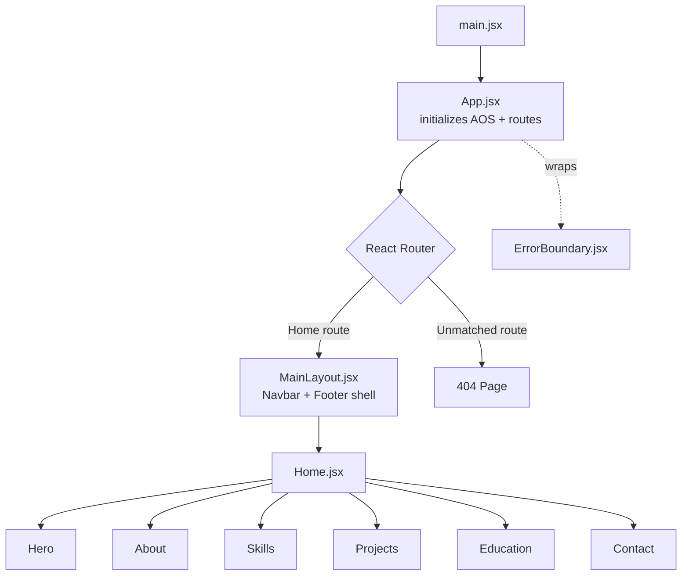

There's no global state library — the only stateful UI lives locally in `Navbar.jsx` (mobile drawer open/close) and `ThemeToggle.jsx` (mount readiness for the theme switch). There's no data-fetching layer, no caching, and no Suspense-based lazy loading; content is static, so none of that is needed yet.

---

## 📁 Folder Structure

```text
portfolio/
├── public/
└── src/
    ├── assets/
    │   ├── images/
    │   │   ├── projects/
    │   │   └── screenshots/
    │   │       ├── desktop/
    │   │       └── mobile/
    │   └── resume/
    │
    ├── components/
    │   ├── common/        # Section wrappers, headings, SEO, cards, theme/error handling
    │   │   └── skills/
    │   ├── layout/        # Navbar, Footer, Container, MainLayout, PageWrapper
    │   ├── sections/      # Hero, About, Skills, Projects, Education, Contact
    │   └── ui/            # Base UI components (shadcn/ui)
    │
    ├── constants/         # Navigation, projects, skills, contact links, site config
    ├── hooks/             # Custom React hooks
    ├── lib/               # Shared utility functions
    └── pages/             # Route-level page components
```

---

## 📸 Screenshots

### Desktop

<table>
  <tr>
    <td align="center" width="50%">
      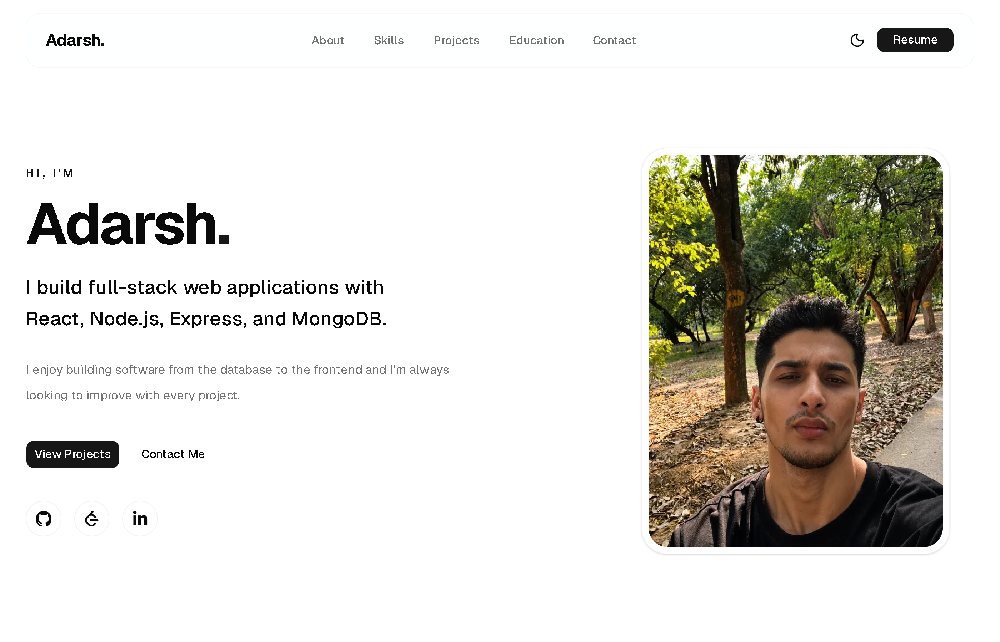
      <br><sub><b>Hero</b></sub>
    </td>
    <td align="center" width="50%">
      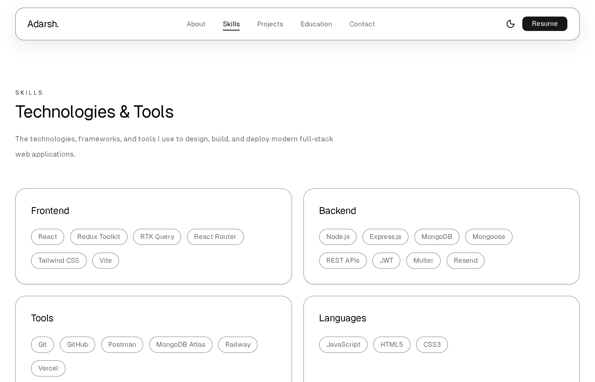
      <br><sub><b>Skills</b></sub>
    </td>
  </tr>

  <tr>
    <td align="center">
      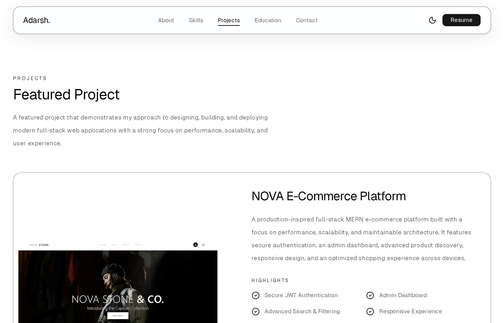
      <br><sub><b>Projects</b></sub>
    </td>
    <td align="center">
      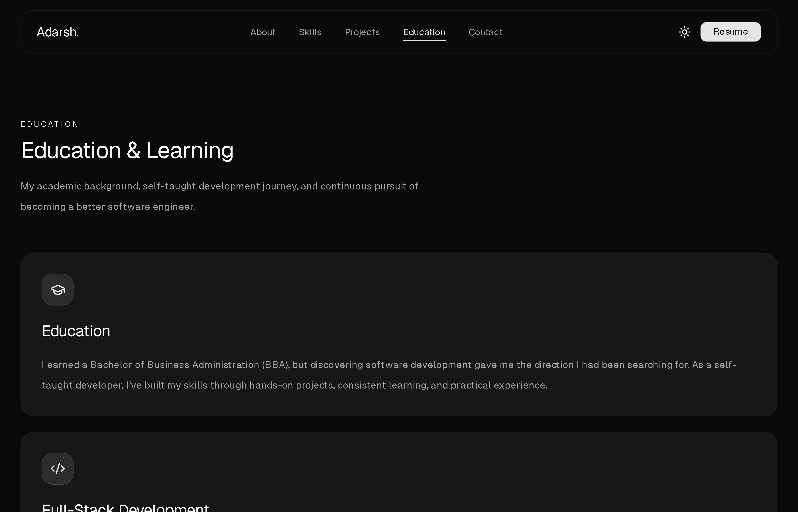
      <br><sub><b>Education</b></sub>
    </td>
  </tr>

  <tr>
    <td align="center">
      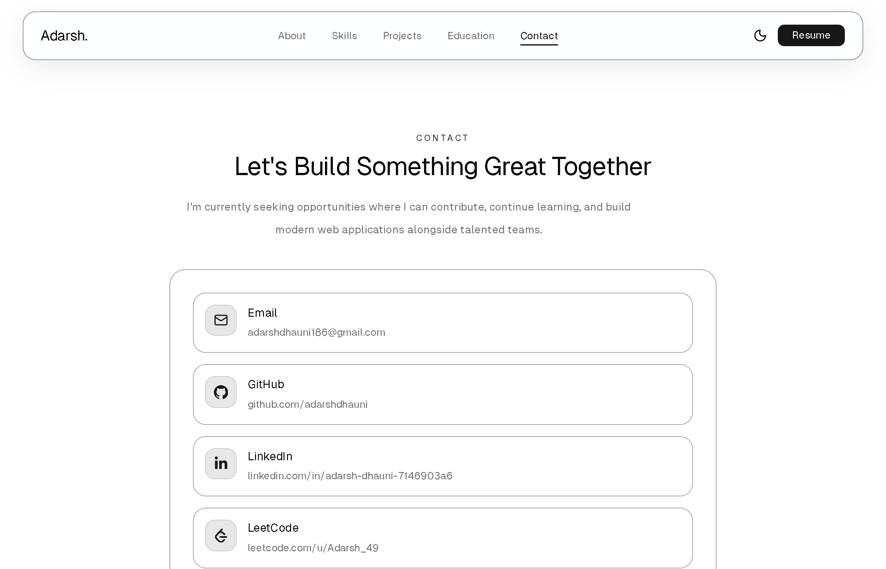
      <br><sub><b>Contact</b></sub>
    </td>
    <td align="center">
      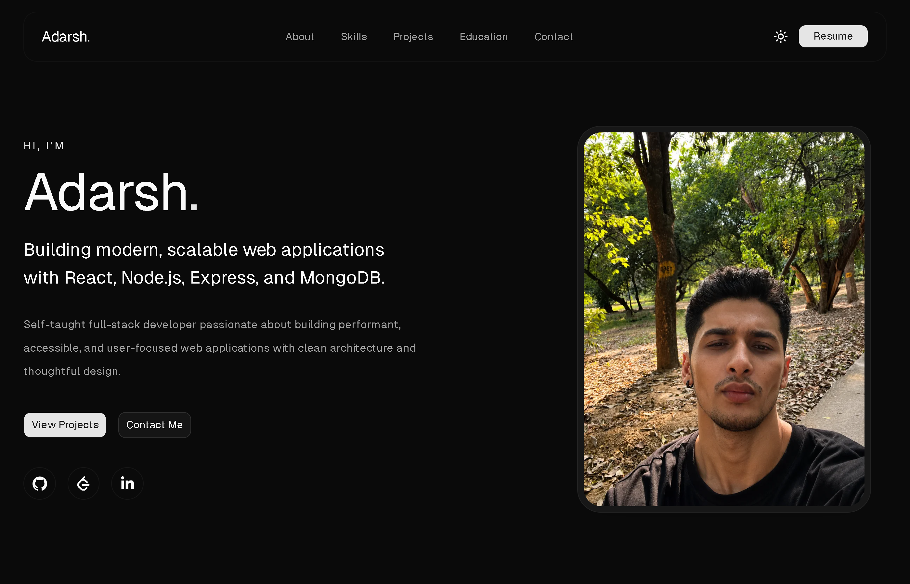
      <br><sub><b>Dark Mode</b></sub>
    </td>
  </tr>
</table>

---

### Mobile

<table>
  <tr>
    <td align="center" width="50%">
      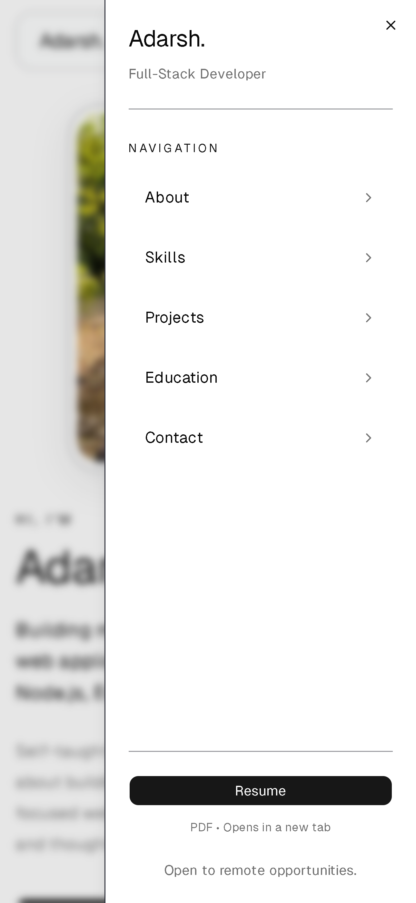
      <br><sub><b>Navigation</b></sub>
    </td>
    <td align="center" width="50%">
      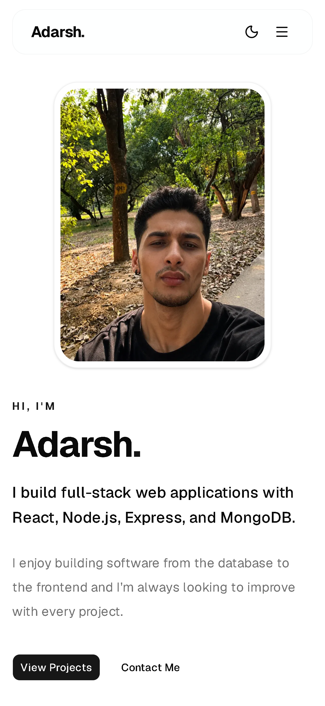
      <br><sub><b>Hero</b></sub>
    </td>
  </tr>

  <tr>
    <td align="center">
      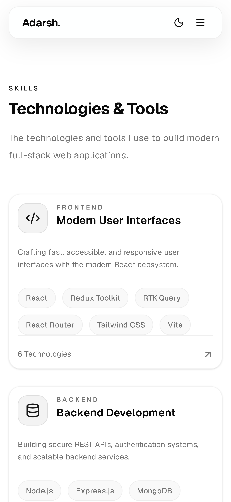
      <br><sub><b>Skills</b></sub>
    </td>
    <td align="center">
      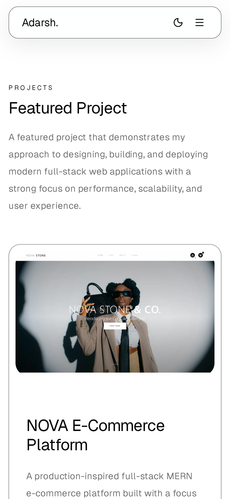
      <br><sub><b>Projects</b></sub>
    </td>
  </tr>

  <tr>
    <td align="center">
      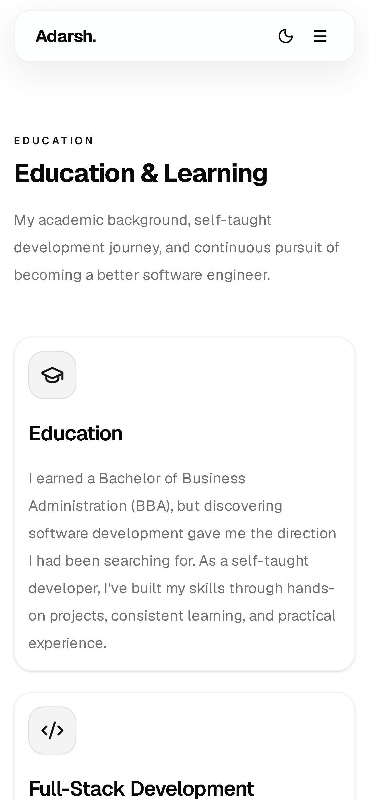
      <br><sub><b>Education</b></sub>
    </td>
    <td align="center">
      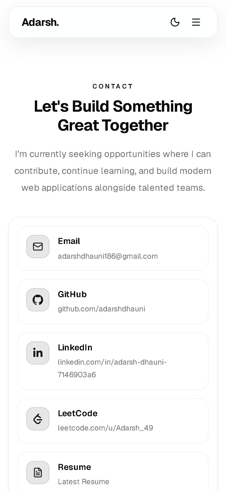
      <br><sub><b>Contact</b></sub>
    </td>
  </tr>

  <tr>
    <td align="center" colspan="2">
      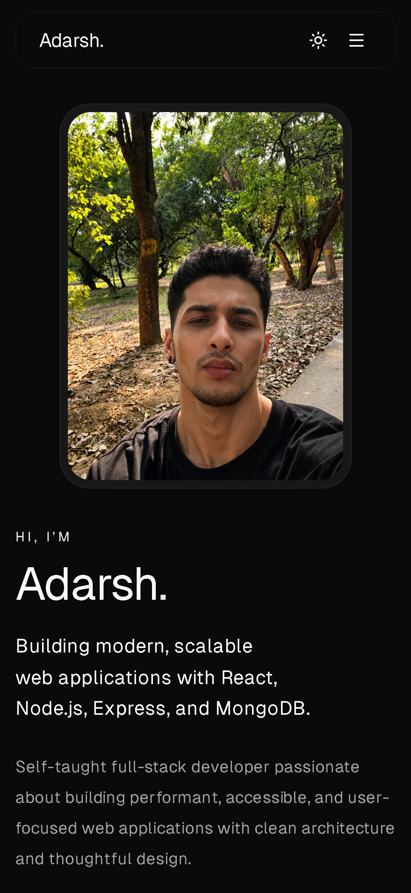
      <br><sub><b>Dark Mode</b></sub>
    </td>
  </tr>
</table>

---

## 🏆 Lighthouse Scores

Measured on the deployed production build.

<table>
  <thead>
    <tr>
      <th>Metric</th>
      <th>🖥️ Desktop</th>
      <th>📱 Mobile</th>
    </tr>
  </thead>
  <tbody>
    <tr>
      <td>⚡ Performance</td>
      <td><strong>100</strong></td>
      <td><strong>96</strong></td>
    </tr>
    <tr>
      <td>♿ Accessibility</td>
      <td><strong>99</strong></td>
      <td><strong>99</strong></td>
    </tr>
    <tr>
      <td>✅ Best Practices</td>
      <td><strong>100</strong></td>
      <td><strong>100</strong></td>
    </tr>
    <tr>
      <td>🔍 SEO</td>
      <td><strong>100</strong></td>
      <td><strong>100</strong></td>
    </tr>
  </tbody>
</table>

---

## 🔍 SEO

- Dynamic page titles and meta descriptions using `react-helmet-async`
- Canonical URLs
- Open Graph metadata
- Twitter Card metadata
- `robots.txt`
- `sitemap.xml`
- Web App Manifest
- Lighthouse SEO score of **100** on both desktop and mobile

---

## 📱 Responsive Design

Built with a mobile-first approach using Tailwind CSS, the interface scales seamlessly across mobile, tablet, laptop, and desktop breakpoints. Responsive images, flexible layouts, and adaptive navigation ensure a consistent experience on every screen size.

---

## 🌓 Theme Support

Light and dark themes are powered by `next-themes`. The application automatically respects the user's system preference on first visit while persisting manual theme selections for subsequent sessions. Mount-aware rendering prevents visual inconsistencies during initialization.

---

## 🧩 Components

| Component           | Folder     | Purpose                                                                   |
| ------------------- | ---------- | ------------------------------------------------------------------------- |
| `Hero.jsx`          | `sections` | Landing section with responsive hero image and primary CTA                |
| `Navbar.jsx`        | `layout`   | Sticky navigation with active-section highlighting and mobile drawer      |
| `MainLayout.jsx`    | `layout`   | Page shell composing navbar, main content, and footer                     |
| `Container.jsx`     | `layout`   | Memoized layout container used across sections                            |
| `Home.jsx`          | `pages`    | Composes all portfolio sections into the home route                       |
| `Seo.jsx`           | `common`   | Injects page title, meta description, canonical link, and OG/Twitter tags |
| `ThemeProvider.jsx` | `common`   | Provides light/dark theme context via `next-themes`                       |
| `ThemeToggle.jsx`   | `common`   | UI control for switching themes                                           |
| `ErrorBoundary.jsx` | `common`   | Catches runtime rendering errors                                          |
| `ErrorFallback.jsx` | `common`   | Fallback UI rendered when `ErrorBoundary` catches an error                |

Beyond these, `common`, `layout`, `sections`, and `ui` each group components by role — `ui` holds the reusable primitives built on Base UI and styled with Tailwind, used across every section.

---

## 🪝 Custom Hooks

The project currently contains two custom hooks focused exclusively on client-side UI behavior:

- **Active Section Hook** — Observes the visible section during scrolling and updates navigation state accordingly.
- **Scroll State Hook** — Tracks scroll position to drive scroll-dependent UI behavior, including sticky navigation.

---

## 🚀 Getting Started

### Prerequisites

- Node.js 18 or later
- npm

### Clone the repository

```bash
git clone https://github.com/adarshdhauni/portfolio.git
cd portfolio
```

### Install dependencies

```bash
npm install
```

### Start the development server

```bash
npm run dev
```

The application will be available at:

```
http://localhost:5173
```

### Build for production

```bash
npm run build
```

### Preview the production build

```bash
npm run preview
```

This serves the optimized production build locally before deployment.

---

## ⚡ Performance

| Optimization | Implementation |
| ------------ | -------------- |
| **Responsive images** | WebP images delivered through `srcSet` and `sizes` so browsers download the most appropriate asset |
| **Image loading** | Above-the-fold hero image prioritized with `fetchPriority="high"` while below-the-fold images use native lazy loading |
| **Memoization** | `memo()` applied to shared layout components to reduce unnecessary re-renders |
| **Animations** | AOS configured with `once: true` so animations execute only once per session |
| **Static architecture** | Frontend-only application with no client-side data fetching, global state management, or API overhead |
| **Production build** | Optimized production bundles generated with Vite and deployed on Vercel for fast global delivery |

> [!NOTE]
> Route-level code splitting, lazy-loaded page components, and server-side rendering are not currently implemented. See [Future Improvements](#future-improvements).

---

## ♿ Accessibility

| Feature | Implementation |
| ------- | -------------- |
| **Semantic HTML** | Proper use of semantic elements including `<main>`, `<nav>`, `<section>`, and `<footer>` |
| **Keyboard Navigation** | Interactive elements are keyboard accessible with logical focus order |
| **Focus Management** | Visible `focus-visible` styles applied to interactive elements for improved keyboard usability |
| **ARIA Labels** | Applied to navigation, theme toggle, and icon-only controls where appropriate |
| **Images** | Descriptive `alt` text provided for images where applicable |
| **Accessibility Audit** | Lighthouse Accessibility score of **99** on both desktop and mobile |

> [!NOTE]
> Automated accessibility testing (for example, with `axe-core`) has not been implemented yet. Accessibility has been verified through semantic HTML, manual testing, and Lighthouse audits.

---

## 🧠 Engineering Decisions

### Content-driven architecture

Project data, navigation links, skills, and copy are centralized in the `constants` directory instead of being embedded throughout components. This keeps presentation and content separate, making updates straightforward without modifying component logic.

### Local state over global state

The application intentionally avoids global state management. Interactive state is limited to isolated UI concerns—such as the mobile navigation drawer and theme initialization—making `useState` sufficient while avoiding unnecessary complexity.

### Component-based page composition

Rather than building the portfolio as one large component, each major section is implemented as an independent component and composed within `Home.jsx`. This improves readability, maintainability, and future extensibility.

### Intentional loading strategy

Images are loaded according to their importance. The above-the-fold hero image is prioritized using `fetchPriority="high"` for faster initial rendering, while non-critical images use native lazy loading to reduce initial network and rendering cost.

### Graceful failure handling

An Error Boundary and custom 404 page ensure runtime errors or invalid routes degrade gracefully instead of presenting users with a blank screen.

---

## 🚨 Error Handling

- `react-error-boundary` catches unexpected rendering errors and displays a custom fallback UI instead of a blank screen
- A dedicated **404 Not Found** page handles invalid routes while preserving a consistent user experience
- Reusable `ErrorFallback` and error state components provide graceful degradation when runtime errors occur

---

## 📜 Available Scripts

| Script            | Description                                            |
| ----------------- | ------------------------------------------------------ |
| `npm run dev`     | Starts the local development server with hot reloading |
| `npm run build`   | Builds the application for production                  |
| `npm run preview` | Serves the production build locally for preview        |
| `npm run lint`    | Lints the codebase using ESLint                        |

---

## 🚀 Deployment

The application is deployed on **Vercel** and configured through `vercel.json`.

Because this is a client-side React application, all unmatched routes are rewritten to `index.html`, allowing React Router to resolve navigation correctly and preventing 404 errors when refreshing deep links.

---

## 🧪 Testing

The application was manually tested across modern desktop and mobile browsers, including navigation, theme switching, responsive layouts, routing, and contact functionality.

Automated testing is planned as a future improvement.

---

## 🧗 Challenges

- **Balancing design and performance** — Creating a visually polished portfolio while maintaining excellent Lighthouse scores required careful image optimization, lazy loading, and avoiding unnecessary JavaScript.
- **Building reusable UI components** — Organizing the application into reusable layouts, sections, and shared UI components improved maintainability and reduced duplication as the project grew.
- **Responsive design across devices** — Ensuring a consistent experience on mobile, tablet, and desktop required careful layout planning, responsive images, and adaptive navigation.
- **SEO for a client-side React application** — Implementing metadata, Open Graph tags, canonical URLs, `robots.txt`, and `sitemap.xml` helped improve discoverability despite using a single-page application.

---

## 🗺️ Future Improvements

### Performance

- [ ] Route-level code splitting with `React.lazy()`
- [ ] Static pre-rendering or server-side rendering to improve initial rendering and SEO
- [ ] Further optimize asset loading and bundle size

### Quality & Testing

- [ ] Unit and integration testing
- [ ] Automated accessibility testing using `axe-core`
- [ ] End-to-end testing with Playwright or Cypress

### Developer Experience

- [ ] TypeScript migration for stronger type safety
- [ ] CI/CD pipeline with automated quality checks
- [ ] Add a `.env.example` for easier local setup

### User Experience

- [ ] Remove or adopt Framer Motion for production animations
- [ ] Improve keyboard navigation and accessibility support
- [ ] Add a command palette or keyboard shortcuts

---

## 🤝 Contributing

Although this is primarily a personal project, feedback, issues, and suggestions are always welcome.

1. Fork the repository
2. Create a feature branch

   ```bash
   git checkout -b feature/your-feature
   ```

3. Commit your changes

   ```bash
   git commit -m "Add your feature"
   ```

4. Push your branch

   ```bash
   git push origin feature/your-feature
   ```

5. Open a Pull Request

> [!TIP]
> For larger changes, please open an issue first to discuss the proposed implementation.

---

## 📄 License

This project is licensed under the **MIT License**.

See the [LICENSE](LICENSE) file for details.

---

## 📬 Contact

**Adarsh Dhauni**

Open to remote, hybrid, and full-time software engineering opportunities, with a preference for remote roles.

📧 **adarshdhauni186@gmail.com**

---

## 🌐 Connect With Me

<p align="left">
  <a href="https://github.com/adarshdhauni">
    
  </a>
    <a href="https://portfolio-xi-silk-b3un2mc452.vercel.app/">
    
  </a>
  <a href="https://www.linkedin.com/in/adarsh-dhauni-7146903a6/">
    
  </a>
  <a href="https://leetcode.com/u/Adarsh_49/">
    
  </a>
  <a href="mailto:adarshdhauni186@gmail.com">
    
  </a>
</p>

---

<div align="center">

Built with ❤️ using React, Vite, and Tailwind CSS.

**Designed, developed, deployed, and maintained by
<a href="https://github.com/adarshdhauni">Adarsh Dhauni</a>.**

</div>
